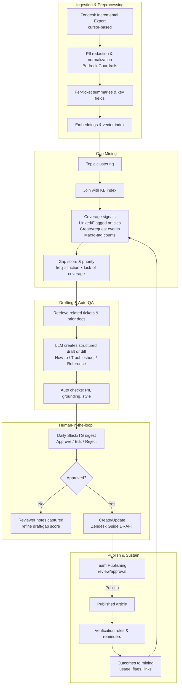

```mermaid
flowchart TB
  %% === Ingestion & Preprocessing ===
  subgraph A[Ingestion & Preprocessing]
    Z[Zendesk Incremental Export<br/>cursor-based] --> R[PII redaction & normalization<br/>Bedrock Guardrails]
    R --> S[Per-ticket summaries & key fields]
    S --> V[Embeddings & vector index]
  end
  
  %% === Gap Mining ===
  subgraph B[Gap Mining]
    V --> TC[Topic clustering]
    TC --> J[Join with KB index]
    J --> SIG[Coverage signals<br/>Linked/Flagged articles<br/>Create/request events<br/>Macro-tag counts]
    SIG --> SCORE[Gap score & priority<br/>freq × friction × lack-of-coverage]
  end
  
  %% === Drafting & Auto-QA ===
  subgraph C[Drafting & Auto-QA]
    SCORE --> RETR[Retrieve related tickets & prior docs]
    RETR --> DRAFT[LLM creates structured draft or diff<br/>How-to / Troubleshoot / Reference]
    DRAFT --> QC[Auto checks: PII, grounding, style]
  end
  
  %% === Human-in-the-loop ===
  subgraph D[Human-in-the-loop]
    QC --> NTFY[Daily Slack/TG digest<br/>Approve / Edit / Reject]
    NTFY --> DEC{Approved?}
    DEC -->|No| FEED[Reviewer notes captured<br/>refine draft/gap score]
    DEC -->|Yes| GD[Create/Update<br/>Zendesk Guide DRAFT]
  end
  
  %% === Publish & Sustain ===
  subgraph E[Publish & Sustain]
    GD --> REV[Team Publishing review/approval]
    REV -->|Publish| LIVE[Published article]
    LIVE --> VER[Verification rules & reminders]
    VER --> LOOP[Outcomes to mining<br/>usage, flags, links]
  end
  
  LOOP --> SIG
```