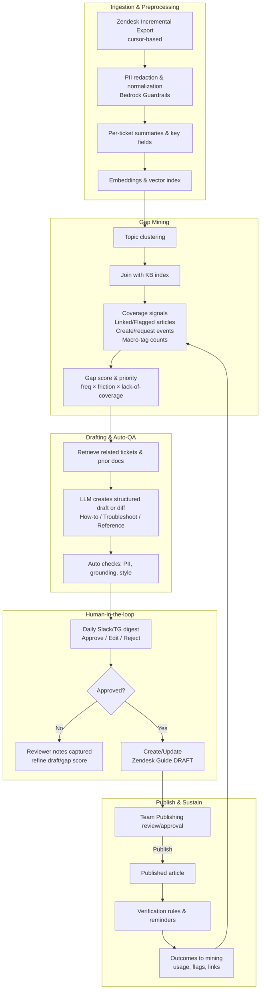

# InstantDocs (internal CSR knowledge builder)

InstantDocs is a lightweight, Bedrock‑powered workflow that mines Zendesk tickets, spots knowledge gaps, and proposes **new or updated internal KB docs**—with a **human‑in‑the‑loop** review in Slack. It’s designed for teams whose knowledge base is used primarily by **CSRs** (not public end‑users), so it prioritizes **agent activity signals** (e.g., linked/flagged/created articles) over public Help Center search metrics.

> **Scope:** early‑stage, backend‑only proof of concept. No frontend, no multi‑tenant controls, no high‑concurrency tuning—just a simple package + daily job you can run locally or on a single EC2 instance/cron.

---

## System overview



---

## What this project does

* **Pulls incremental Zendesk tickets** (cursor‑based) and **Help Center articles**.
* **Redacts PII** and normalizes content before any modeling.
* Builds **ticket summaries + embeddings**, clusters topics, and detects **coverage gaps** in the KB (with internal signals like Linked/Flagged/Created).
* **Drafts** new docs (or **diffs** to existing docs) using structured templates (How‑to, Troubleshooting, Reference).
* Runs **auto‑QA** (groundedness & content rules), then posts a **daily Slack digest** with Approve / Edit / Reject actions.
* On approval, **creates/updates Zendesk Guide drafts** (no auto‑publish). Team Publishing handles the final review.

---

## Tech stack (minimal defaults)

* **AWS Bedrock**

  * *LLM (agent/writer):* configurable (start with an available text FM in your region).
  * *Embeddings:* Titan Text Embeddings or Cohere Embed (via Bedrock).
  * *Guardrails:* for PII redaction and **contextual grounding** checks.
  * *Vector store:* via **Knowledge Bases for Bedrock** quick‑create (e.g., Amazon OpenSearch Serverless Vector Engine or **Amazon S3 Vectors**)—keeps infra simple.
* **Zendesk APIs**

  * Incremental Export for tickets, Help Center (Guide) Articles & **Translations** endpoints for article bodies.
  * Team Publishing + Verification rules (use the product UI/flow; API for drafts/updates where appropriate).
* **Slack**

  * Daily digest (scheduled) with **Block Kit** actions for Approve / Edit / Reject.
* **Python 3.11+**

  * `boto3` (Bedrock & KB/Guardrails), `requests` (Zendesk, Slack), `pydantic` (config), `numpy`/`scikit-learn` (basic clustering), `uv` or `pip` for deps.

---

## Quickstart

1. **Prereqs**

   * AWS account with Bedrock access in your region; enable **Knowledge Bases** and **Guardrails**.
   * Zendesk API token with permission to read tickets and manage Help Center drafts/translations.
   * Slack bot token with chat:write & interactivity enabled.

2. **Configure**

   * Copy `.env.example` → `.env` and set:

     ```
     AWS_REGION=us-east-1
     BEDROCK_MODEL_ID=...           # writer model
     BEDROCK_EMBEDDING_MODEL_ID=... # e.g., titan-embed-text
     BEDROCK_GUARDRAIL_ID=...       # your Guardrail policy
     KB_VECTOR_STORE=opensearch|s3  # initial vector store choice via Bedrock KB
     ZENDESK_SUBDOMAIN=...
     ZENDESK_EMAIL=...
     ZENDESK_API_TOKEN=...
     ZENDESK_LOCALE=en-us
     SLACK_BOT_TOKEN=xoxb-...
     SLACK_CHANNEL_ID=C123...
     ```
   * (One‑time) Create a **Knowledge Base** in Bedrock (console quick‑create) and point `KB_ID` in your config if you choose to use KB APIs directly.

3. **Install & run**

   ```bash
   uv pip install -r requirements.txt   # or pip install -r requirements.txt
   python scripts/backfill_ingest.py    # one-time historical ingest (respects rate limits)
   python scripts/run_daily_cycle.py    # ingestion → mining → drafts → Slack digest
   ```

4. **Human review → publish**

   * Approve a draft from Slack; the tool updates/creates a **Zendesk Guide draft translation**.
   * Your editors use **Team Publishing** to review & publish. Verification rules keep it fresh.

---

## Data handling & privacy

* Prompts/responses stay **inside your AWS account**; Bedrock **does not store or use them for training**.
* We run **PII redaction & content filters** via Guardrails **before** writing to vector stores or posting to Slack.
* Zendesk ticket data is used for internal KB improvements only.

---

## What’s not included (yet)

* Frontend or admin UI
* Multi‑workspace tenancy, SSO, or role‑based editorial policies
* Heavy autoscaling / queue workers
* Telemetry dashboards (only simple logs/metrics for now)

---

## References & notes

* Bedrock **data protection** (no prompt/response retention or model training). ([AWS Documentation][1])
* **Guardrails**: PII redaction, content filters, **contextual grounding** to catch hallucinations. ([AWS Documentation][2])
* **Knowledge Bases for Bedrock** and supported vector stores (OpenSearch Serverless Vector Engine, Aurora, MongoDB Atlas, Pinecone, Redis Enterprise Cloud; S3 Vectors now documented). ([Amazon Web Services, Inc.][3])
* **Titan / Cohere embeddings** on Bedrock. ([AWS Documentation][4])
* Zendesk **Incremental Export** (cursor‑based). ([Zendesk Developer Documentation][5])
* Zendesk **Articles** & **Translations** APIs (use Translations to update body/title), **Team Publishing**, and **Verification rules**. ([Zendesk Developer Documentation][6])
* Zendesk **Knowledge** internal signals (Linked / Flagged / Created). ([Zendesk Support][7])
* Slack **scheduled messages** and interactive **Block Kit** actions. ([Slack Developer Docs][8])